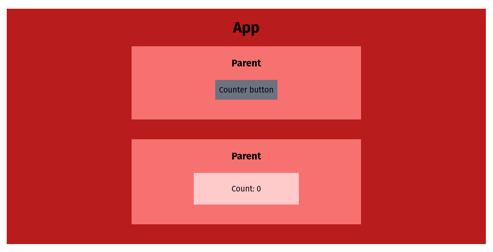

# Minimal context examples

```bash
# install
pnpm install
# OR
npm install

# run
vite
```

This repo shows 4 minimal examples (button click -> display count) of how state can be shared _across_ react components. Each branch holds a different method:

- `main`: using context, with as much as possible abstracted to the context.
- `minimal-context`: using context, with as little as possible abstracted to the context.
- `prop-drilling`: with props passed down through intermediary components.
- `prop-sharing-composition`: with props passed directly to sub-child components.

The component structure in each case is:

- App
    - Parent
        - Button
    - Parent
        - Child

